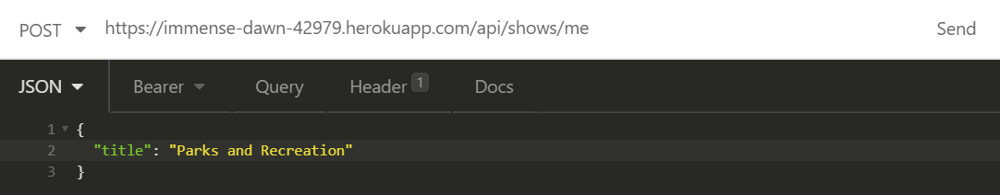

# project-2

This app uses Sequelize and Node.js to set up a WatchList express app. The shows in the database are added by authenticated users, and the [TVMaze API](https://www.tvmaze.com/api) is used to provide further information on each title, so it doesn't need to be stored in our database. 
The app is deployed on heroku under [https://immense-dawn-42979.herokuapp.com/](https://immense-dawn-42979.herokuapp.com/). In order to use all endpoints, [insomnia](https://insomnia.rest/) or another client should be used to sign in and send data. 

# concept
This app was made to allow users to track shows they want to watch, shows they're currently watching, and shows that they have already completed.

Because we didn't want to restrict users from tracking shows that may be in another language or from another medium like a webseries, although we use the TvMaze API to get additional show data, users can add shows that aren't listed there.

When a frontend is added, we want users to be able to see a page that displays the watchlist of another user, so friends can share what they're watching with each other. 
A separate endpoint has not been created to display a user's watchlist by email or id, since we return that information when we use the endpoint to return a single user by email or id: '`.../api/users/:query`'. In frontend javascript, we can use what's returned from that endpoint to display just the username and watchlist data. 

To round out our endpoints, we also wanted to provide some metadata about the shows listed in our database so we are also working on endpoints that will see which shows appear most often and return popular shows.

# usage
Since there's no front end, to test out the app we've been using insomnia. Following will be instructions on how to use insomnia to test each endpoint.

You can get some data without being logged in, but most things will require authentication. Since we're not using the browser, after logging in, you'll be required to send your webtoken along with your request.

Your steps are to:
1. [Create your user information if you're not already in the database.](#post-|-create-user)
2. [Log in with your email and password, and save the webtoken given to you.](#post-|-log-in)
3. When sending requests to endpoints that require authentication, make sure to send your webtoken as well!

## Routes List:
* [POST - Create User](#post-|-create-user)
* [POST - Log In](#post-|-log-in)
* [GET - Get My Watchlist](#get-|-get-my-watchlist)
* [POST - Add to My Watchlist](#post-|-add-to-watchlist)
* [GET - Get one Show from My Watchlist by title/id](#get-|-get-from-watchlist)
* [PUT - Update Show on My Watchlist](#put-|-update-show-on-watchlist)
* [GET - Get List of Users](#get-|-get-all-users)
* [GET - Get one User by email/id](#get-|-get-one-user)
* [GET - Get All Show Instances in Database](#get-|-get-all-shows)
* [GET - Get Show's TvMaze Info by title/id](#)
* GET - Get list of Database's Most to Least Popular Shows
* GET - Get list of Database's Most to Least Popular Shows To Watch
* GET - Get list of Database's Most to Least Popular Shows Being Watched
* GET - Get list of Database's Most to Least Popular Shows Completed

## [POST | Create User](#post-|-create-user)
`https://immense-dawn-42979.herokuapp.com/api/users`
#### REQUEST: 


Select Text > JSON to send. Use this object format:
```
{
	"name": "Name",
	"email": "me@address.com",
	"password": "1234"
}
````
#### RESPONSE:
The 200 response should show you the new user object you created.
## POST | Log in
`https://immense-dawn-42979.herokuapp.com/api/auth`
#### REQUEST:


Select Text > JSON to send. Use this object format:
```
{
	"email": "me@address.com",
	"password": "1234"
}
````
#### RESPONSE:


Make sure to copy the token between the double quotes to use in other requests.

## GET | Get My Watchlist
`https://immense-dawn-42979.herokuapp.com/api/shows/me`
#### REQUEST: 


The only data you will need to send is your token. 
Select Auth > Bearer token. Then paste your token in the token field.
#### RESPONSE:
The 200 response should show you an array containing all of the show objects you added while using the token associated with the logged in user. If you haven't added any shows, it will return an empty array.

## POST | Add to Watchlist
`https://immense-dawn-42979.herokuapp.com/api/shows/me`
#### REQUEST: 


Remember to add to your Watchlist you need to send your token. Select Auth > Bearer token. Then paste your token in the token field.



You can send the title only, in which case it will be set as `toWatch = true` by default. If you want to specify it should be listed as something else, you must add all three in the object:
```
{
	"title": "The Office",
	"toWatch": false,
	"watching": true,
	"completed": false
}
```
_If front end javascript is added, the user will be able to select `toWatch`, `watching`, or `completed`. Whichever is selected will be set true and the other two false in the request. But since that doesn't exist, all three fields must be defined when you are defining this._
#### RESPONSE: 
The 200 response should return an object containing the new Show you added to your Watchlist. Unless otherwise specified, `toWatch` is set `true` and the others are set `false`.

## GET | Get from Watchlist
`https://immense-dawn-42979.herokuapp.com/api/shows/me/:query`

#### REQUEST:
'`:query`' should be replaced by the show's title (including spaces) or by the show's id in our database.


Remember to send your token. Select Auth > Bearer token. Then paste your token in the token field.
#### RESPONSE:
The 200 response should return a Show object from your watchlist with a title or id matching what replaced '`:query`'.

## PUT | Update Show on Watchlist
`https://immense-dawn-42979.herokuapp.com/api/shows/me/:query`

#### REQUEST:
'`:query`' should be replaced by the show's title (including spaces) or by the show's id in our database.


Remember to send your token. Select Auth > Bearer token. Then paste your token in the token field.


This can be used to update any part of the Show object, such as title if it's been mispelled, but its main usage is to update the watch status by chaning the booleans `toWatch`, `watching`, and `completed`. 
Select Text > JSON to send. Use this object format:
```
{
	"toWatch": "false",
	"watching": "false",
  "completed: "true"
}
````
_If front end javascript is added, the user will be able to select `toWatch`, `watching`, or `completed`. Whichever is selected will be set true and the other two false in the request. But since that doesn't exist, all three fields must be defined when you are defining this._
#### RESPONSE:
The 200 response should return a message that lets you know whether the update was successful or not.

## GET | Get All Users
`https://immense-dawn-42979.herokuapp.com/api/users`
#### REQUEST: 


Authentication isn't needed, and you don't need to send any data. So this can be used in the browser too, if you want.
#### RESPONSE:


The 200 response will return an array containing all user objects (not including their watchlists).

## GET | Get one User
`https://immense-dawn-42979.herokuapp.com/api/users/:query`
#### REQUEST:
'`:query`' should be replaced by the user's email or by their id in our database.


Authentication isn't needed, and you don't need to send any JSON data. So this can be used in the browser too, if you want.
#### RESPONSE:


The 200 response will return a user object with an email or id matching what replaced '`:query`' (including a `"Shows"` field which a value of an array containing objects of all Shows on their watchlist).

## GET | Get All Shows
`https://immense-dawn-42979.herokuapp.com/api/shows/all`
#### REQUEST


Authentication isn't needed, and you don't need to send any data. So this can be used in the browser too, if you want.
#### RESPONSE
The 200 response will return an array containing all show objects in the database, with their associated `userId`. This response will contain duplicate titles if multiple users have entered the same title. Each instance can be distinguished by either their `id` or their associated `userId`.

# credits
[Lee Chenalloy](https://github.com/chenallee)

[Brett Smith](https://github.com/BRETTSMITH103)

[Rodny Excellent](https://github.com/Rodnyex)